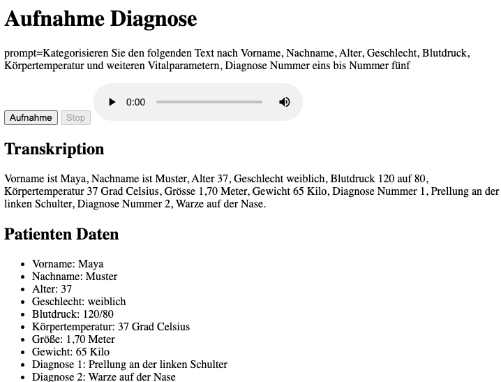

# Speech2Structure

## Voraussetzungen

- Python 3.8 oder höher
- Flask
- OpenAI API-Schlüssel
- `pip` (Python-Paket-Installer)
- Miniconda (optional, zum Erstellen einer virtuellen Umgebung)

## Installation

1. Klone das Repository:
    ```sh
    git clone https://github.com/yourusername/speech2structure.git
    cd speech2structure
    ```

2. Erstelle und aktiviere eine virtuelle Umgebung mit Miniconda:
    ```sh
    conda create -n speech2structure python=3.8
    conda activate speech2structure
    ```

3. Installiere die benötigten Pakete:
    ```sh
    pip install -r requirements.txt
    ```

4. Erstelle eine `.env` Datei im Projektverzeichnis und füge deinen OpenAI API-Schlüssel hinzu:
    ```env
    OPENAI_API_KEY=dein_openai_api_schlüssel
    ```

## Build

Für dieses Projekt sind keine Build-Schritte erforderlich.

## Ausführen / Im Webbrowser aufrufen

1. Starte den Flask-Server:
    ```sh
    python app.py
    ```

2. Öffne deinen Webbrowser und navigiere zu:
    ```
    http://127.0.0.1:5000/
    ```

3. Verwende die Weboberfläche, um Audio aufzunehmen und zu verarbeiten.

# Demo
